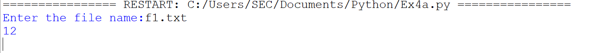

# Word-count
## AIM:
To write a python program for getting the word count from a text.
## EQUIPEMENT'S REQUIRED: 
PC
Anaconda - Python 3.7
## ALGORITHM: 
### Step 1:
Get the file name from the user
### Step 2: 
Open the file in read mode
### Step 3: 
Use for loop to iterate through each line in file
### Step 4:  
Use split() function to get a list of words in the line.
### Step 5: 
Add the number of words using a variable
### Step 6: 
Print the number of words
## PROGRAM:
```python
'''
Program to count the number of words
Developed by:A.J.PRANAV
Reference Number:22008772
'''
fname=input("Enter the file name:")
num_words=0
with open(fname,'r')as f:
    for line in f:
        words=line.split()
        num_words+=len(words)
print(num_words)
```
### OUTPUT:

## RESULT:
Thus the program is written to find the word count from a text.
